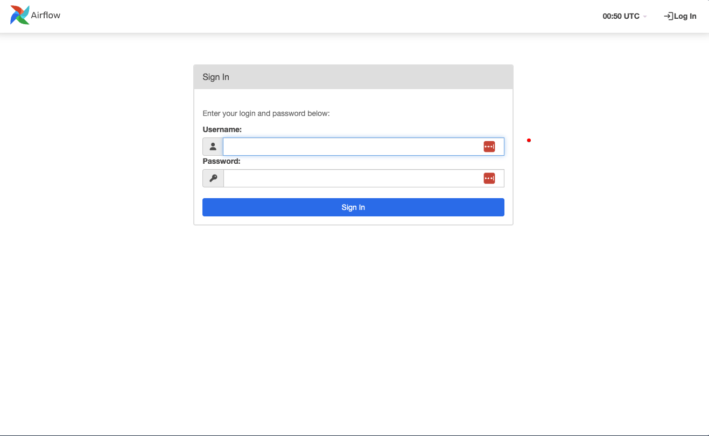
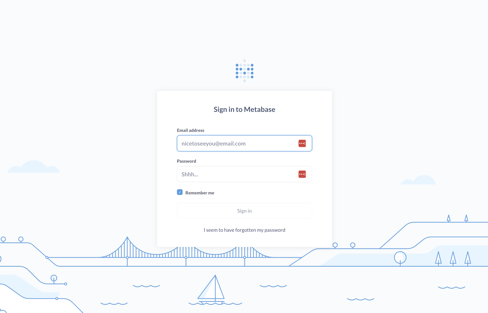
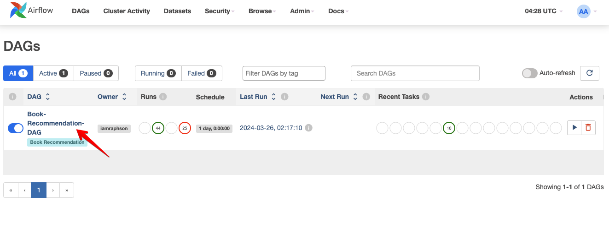
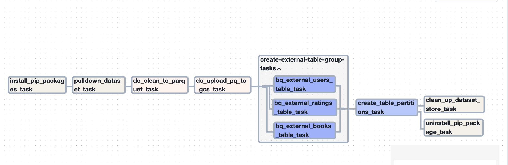
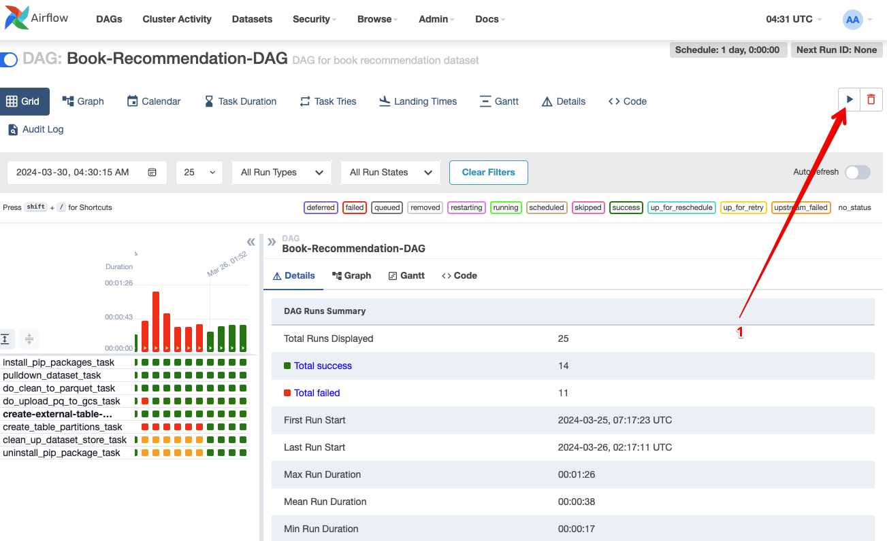
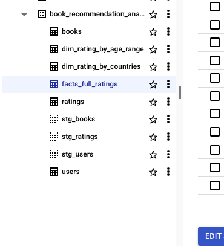
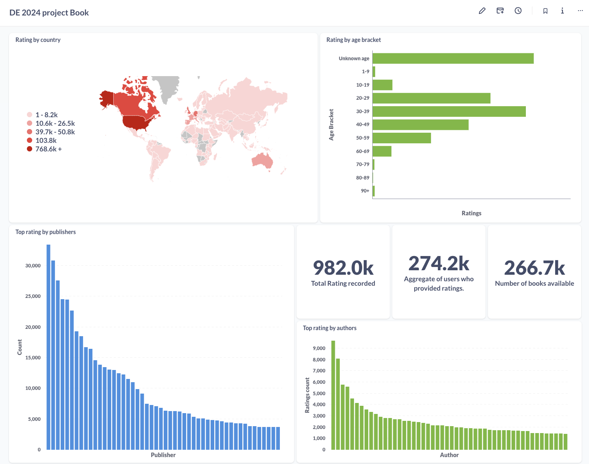

# Data Pipeline Project for Book Recommendation

<details>
    <summary>Table of Contents</summary>
    <ol>
        <li>
            <a href="#introduction">Introduction</a>
            <ul>
                <li><a href="#built-with">Built With</a></li>
            </ul>
        </li>
        <li>
            <a href="#project-architecture">Project Architecture</a>
        </li>
        <li>
             <a href="#getting-started">Getting Started</a>
             <ul>
                <li>
                <a href="#create-a-google-cloud-project">Create a Google Cloud Project<a>
                </li>
                <li>
                <a href="#set-up-kaggle">Set up Kaggle<a>
                </li>
                <li>
                    <a href="#set-up-the-infrastructure-on-GCP-with-terraform">Set up the infrastructure on GCP with Terraform</a>
                </li>
                <li>
                    <a href="#set-up-airflow-and-metabase">Set up Airflow and Metabase</a>
                </li>
            </ul>
        </li>
        <li>
            <a href="#data-ingestion">Data Ingestion</a>
        </li>
        <li>
            <a href="#data-transformation">Data Transformation</a>
        </li>
        <li>
            <a href="#data-visualization">Data Visualization</a>
        </li>
        <li>
            <a href="#contact">Contact</a>
        </li>
         <li>
            <a href="#acknowledgments">Acknowledgments</a>
        </li>
    </ol>
</details>

## Introduction

This project is part of the [Data Engineering Zoomcamp](https://github.com/DataTalksClub/data-engineering-zoomcamp). As part of the project, I developed a data pipeline to load and process data from a Kaggle dataset containing bookstore information for a book recommendation system. The dataset can be accessed on [this Kaggle](https://www.kaggle.com/datasets/arashnic/book-recommendation-dataset/).

This dataset offers book ratings from users of various ages and geographical locations. It comprises three files: User.csv, which includes age and location data of bookstore users; Books.csv, containing information such as authors, titles, and ISBNs; and Ratings.csv, which details the ratings given by users for each book. Additional information about the dataset is available on Kaggle.

The primary objective of this project is to establish a streamlined data pipeline for obtaining, storing, cleansing, and visualizing data automatically. This pipeline aims to address various queries, such as identifying top-rated publishers and authors, and analyzing ratings based on geographical location.

Given that the data is static, the data pipeline operates as a one-time process.

### Built With

- Dataset repo: [Kaggle](https://www.kaggle.com)
- Infrastructure as Code: [Terraform](https://www.terraform.io/)
- Workflow Orchestration: [Airflow](https://airflow.apache.org)
- Data Lake: [Google Cloud Storage](https://cloud.google.com/storage)
- Data Warehouse: [Google BigQuery](https://cloud.google.com/bigquery)
- Transformation: [DBT](https://www.getdbt.com/)
- Visualisation: [Metabase](https://www.metabase.com/)
- Programming Language: Python and SQL

## Project Architecture


Cloud infrastructure is set up with Terraform.

Airflow is run on a local docker container.

## Getting Started

### Prerequisites

1. A [Google Cloud Platform](https://cloud.google.com/) account.
2. A [kaggle](https://www.kaggle.com/) account.
3. Install VSCode or [Zed](https://zed.dev/) or any other IDE that works for you.
4. [Install Terraform](https://www.terraform.io/downloads)
5. [Install Docker Desktop](https://docs.docker.com/get-docker/)
6. [Install Google Cloud SDK](https://cloud.google.com/sdk)
7. Clone this repository onto your local machine.

### Create a Google Cloud Project

- Go to [Google Cloud](https://console.cloud.google.com/) and create a new project.
- Get the project ID and define the environment variables `GCP_PROJECT_ID` in the .env file located in the root directory
- Create a [Service account](https://cloud.google.com/iam/docs/service-account-overview) with the following roles:
  - `BigQuery Admin`
  - `Storage Admin`
  - `Storage Object Admin`
  - `Viewer`
- Download the Service Account credentials and store it in `$HOME/.google/credentials/`.
- You need to activate the following APIs [here](https://console.cloud.google.com/apis/library/browse)
  - Cloud Storage API
  - BigQuery API
- Assign the `GOOGLE_APPLICATION_CREDENTIALS` environment variable to the path of your JSON credentials file, such that `GOOGLE_APPLICATION_CREDENTIALS` will be $HOME/.google/credentials/<authkeys_filename>.json
  - add this line to the end of the `.bashrc` file
  ```bash
  export GOOGLE_APPLICATION_CREDENTIALS=${HOME}/.google/google_credentials.json
  ```
  - Activate the enviroment variable by runing `source .bashrc`

### Set up kaggle

- A detailed description on how to authenicate is found [here](https://www.kaggle.com/docs/api)
- Define the environment variables `KAGGLE_USER` and `KAGGLE_TOKEN` in the .env file located in the root directory. Note: `KAGGLE_TOKEN` is the same as `KAGGLE_KEY`

### Set up the infrastructure on GCP with Terraform

- Using Zed or VSCode, open the cloned project `DE-2024-project-bookrecommendation`.
- To customize the default values of `variable "project"` and `variable "region"` to your preferred project ID and region, you have two options: either edit the variables.tf file in Terraform directly and modify the values, or set the environment variables `TF_VAR_project` and `TF_VAR_region`.
- Open the terminal to the root project.
- Navigate to the root directory of the project in the terminal and then change the directory to the terraform folder using the command `cd terraform`.
- Set an alias `alias tf='terraform'`
- Initialise Terraform: `tf init`
- Plan the infrastructure: `tf plan`
- Apply the changes: `tf apply`

### Set up Airflow and Metabase

- Please confirm that the following environment variables are configured in `.env` in the root directory of the project.
  - `AIRFLOW_UID`. The default value is 50000
  - `KAGGLE_USERNAME`. This should be set from [Set up kaggle](#set-up-kaggle) section.
  - `KAGGLE_TOKEN`. This should be set from [Set up kaggle](#set-up-kaggle) section too
  - `GCP_PROJECT_ID`. This should be set from [Create a Google Cloud Project](#create-a-google-cloud-project) section
  - `GCP_BOOK_RECOMMENDATION_BUCKET=book_recommendation_datalake_<GCP project id>`
  - `GCP_BOOK_RECOMMENDATION_WH_DATASET=book_recommendation_analytics`
  - `GCP_BOOK_RECOMMENDATION_WH_EXT_DATASET=book_recommendataion_wh`
- Run `docker-compose up`.
- Access the Airflow dashboard by visiting `http://localhost:8080/` in your web browser. The interface will resemble the following. Use the username and password airflow to log in.



- Visit `http://localhost:1460` in your web browser to access the Metabase dashboard. The interface will resemble the following. You will need to sign up to use the UI.



## Data Ingestion

Once you've completed all the steps outlined in the previous section, you should now be able to view the Airflow dashboard in your web browser. Below will display as list of DAGs

Below is the DAG's graph.

To run the DAG, Click on the play button(Figure 1)


## Data Transformation

- Navigate to the root directory of the project in the terminal and then change the directory to the terraform folder using the command `cd data_dbt`.
- Generate a profiles.yml file within `${HOME}/.dbt`, followed by defining a profile for this project as instructed below.

```yaml
data_dbt_book_recommendation:
  outputs:
    dev:
      dataset: book_recommendation_analytics
      fixed_retries: 1
      keyfile: <location_google_auth_key>
      location: <preferred project region>
      method: service-account
      priority: interactive
      project: <preferred project id>
      threads: 6
      timeout_seconds: 300
      type: bigquery
  target: dev
```

- To run all models, run `dbt run -t dev`
- Navigate to your Google [BigQuery](https://console.cloud.google.com/bigquery) project by clicking on this link. There, you'll find all the tables and views created by DBT.
  

## Data Visualization

Please watch the [provided video tutorial](https://youtu.be/BnLkrA7a6gM&) to configure your Metabase database connection with BigQuery.You have the flexibility to customize your dashboard according to your preferences. Additionally, this [PDF](./screenshots/DE_2024_Dashboard.pdf) linked below contains the complete screenshot of the dashboard I created.



## Contact

Twitter: [@iamraphson](https://twitter.com/iamraphson)

## Acknowledgments

I would like to extend my heartfelt gratitude to the organizers of the [Data Engineering Zoomcamp](https://github.com/DataTalksClub/data-engineering-zoomcamp) for providing such a valuable course. The insights I gained have been instrumental in broadening my understanding of the field of Data Engineering. Additionally, I want to express my appreciation to my fellow colleague with whom I took the course. Thank you all for your support and collaboration throughout this journey.

🦅
